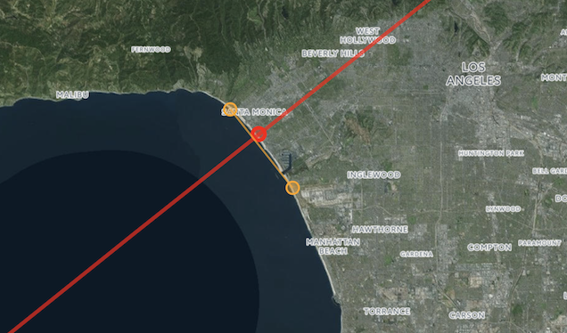

# What's on the other side of the sea?

This is the source code for the web app deployed [here](https://ranlot.shinyapps.io/coastlinetrip/).

Imagine you're standing on some beach and face straight out to the sea.  The app will show you which countries
you would cross if you decided to follow this path and go around the world.  In particular, it shows what lies directly
on the other side of the sea when you **stare out into the ocean**.

The result is sometimes **surprising** as you can see in the
examples below.  As it turns out, Atlantic City, NJ is actually facing straight towards South America and certainly not
old Europe as one might have thought.  Amazingly, doing the same from Venice Beach, CA would take you all the way to Madagascar 
and East Africa.

